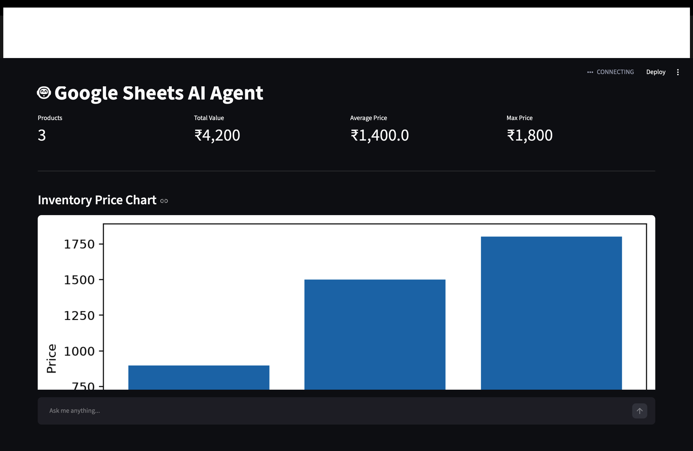
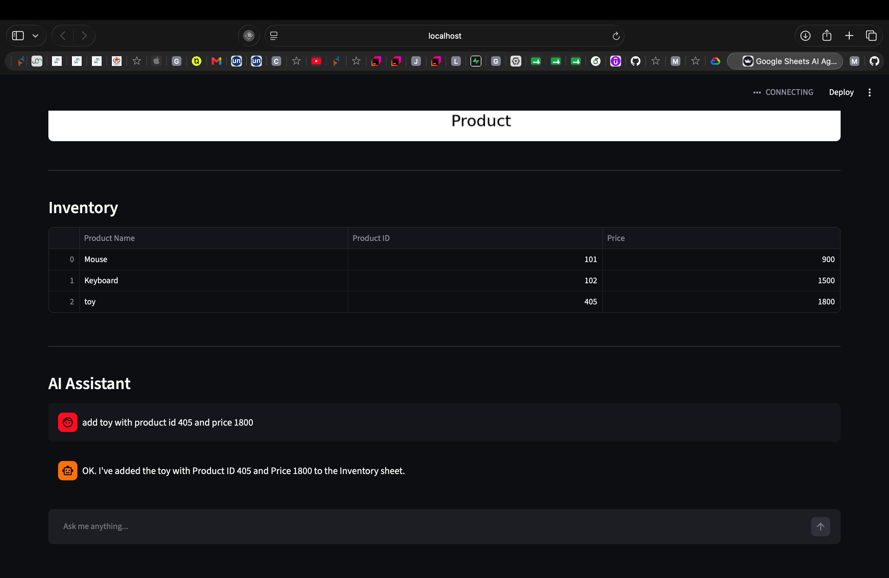

# 🤖 Google Sheets AI Agent

An AI-powered inventory management system that enables users to manage Google Sheets using natural language. Built with **Python**, **LangGraph**, **Google Gemini**, **Google Sheets API**, and **Streamlit**, the application supports intelligent tool calling for CRUD operations along with a real-time analytics dashboard.

---

## ✨ Features

- 🤖 Natural language inventory management
- 📄 Google Sheets integration
- ➕ Add products using plain English
- 🔍 Search products instantly
- ✏️ Update existing records
- ❌ Delete products from inventory
- 📊 Real-time dashboard analytics
- 📈 Interactive inventory price chart
- 📋 Live inventory table
- 💬 AI-powered chat interface
- ⚡ LangGraph ReAct Agent for intelligent tool calling
- 🧩 Modular and scalable project architecture

---

## 🛠️ Tech Stack

| Category | Technologies                 |
|----------|------------------------------|
| Programming | Python                       |
| AI Framework | LangGraph, LangChain         |
| LLM | Google Gemini 3.1 Flash-lite |
| Database | Google Sheets                |
| API | Google Sheets API            |
| Frontend | Streamlit                    |
| Data Processing | Pandas                       |
| Visualization | Matplotlib                   |
| Environment | python-dotenv                |

---

# 📸 Application Preview

## Dashboard

> Displays inventory statistics, analytics, and price visualization.



---

## AI Assistant

> Manage your inventory using natural language.



---

# 🚀 Features Demonstration

### Add Product

```text
Add Mouse with Product ID 101 and Price 900
```

---

### Search Product

```text
Search Mouse
```

---

### Update Product

```text
Update Mouse price to 1200
```

---

### Delete Product

```text
Delete Mouse
```

---

# 🏗️ Project Architecture

```text
                    User
                      │
                      ▼
            Streamlit Web Interface
                      │
                      ▼
              LangGraph ReAct Agent
                      │
         ┌────────────┼────────────┐
         │            │            │
         ▼            ▼            ▼
   Append Tool   Search Tool   Update Tool
         │            │            │
         └────────────┼────────────┘
                      ▼
               Google Sheets API
                      │
                      ▼
               Google Spreadsheet
```

---

# 📁 Project Structure

```text
GoogleSheetsAIAgent/

├── agent/
│   ├── graph.py
│   ├── generic_tools.py
│   ├── schemas.py
│   └── __init__.py
│
├── dashboard/
│   ├── stats.py
│   └── __init__.py
│
├── sheets/
│   ├── generic_append.py
│   ├── generic_search.py
│   ├── generic_update.py
│   ├── generic_delete.py
│   ├── read.py
│   ├── schema.py
│   ├── service.py
│   ├── utils.py
│   └── __init__.py
│
├── ui/
│   ├── app.py
│   └── __init__.py
│
├── config.py
├── prompts.py
├── app.py
├── requirements.txt
└── README.md
```

---

# ⚙️ Installation

Clone the repository

```bash
git clone https://github.com/naveenkkr75/google-sheets-ai-agent.git

cd google-sheets-ai-agent
```

Create a virtual environment

```bash
python -m venv .venv
```

Activate the virtual environment

### macOS/Linux

```bash
source .venv/bin/activate
```

### Windows

```bash
.venv\Scripts\activate
```

Install dependencies

```bash
pip install -r requirements.txt
```

---

# 🔐 Environment Variables

Create a `.env` file in the project root.

```env
GOOGLE_SERVICE_ACCOUNT=service_account.json
SPREADSHEET_ID=YOUR_SPREADSHEET_ID
GEMINI_API_KEY=YOUR_GEMINI_API_KEY
```

---

# ▶️ Run the Application

### Command Line Interface

```bash
python app.py
```

---

### Streamlit Dashboard

```bash
python -m streamlit run ui/app.py
```

---

# 📊 Dashboard Metrics

The application provides live inventory insights including:

- Total Products
- Total Inventory Value
- Average Product Price
- Maximum Product Price
- Inventory Price Distribution Chart
- Live Inventory Table

---

# 🧠 AI Capabilities

The AI assistant can:

- Understand natural language commands
- Select the appropriate tool automatically
- Perform CRUD operations on Google Sheets
- Handle multiple inventory-related queries
- Provide conversational responses

---

# 🔮 Future Enhancements

- User Authentication
- Export Inventory to CSV/PDF
- Product Images
- Multi-user Support
- Advanced Analytics Dashboard
- Email Notifications
- Docker Deployment
- Cloud Deployment

---

# 👨‍💻 Author

**Naveen Kumar**

Final Year Engineering Student

GitHub: https://github.com/naveenkkr75
## Live Demo

https://app-sheets-ai-agent-ys9m9vnfrggkne3c7geks7.streamlit.app/

---

## ⭐ If you found this project useful, consider giving it a star!